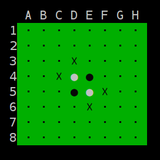

## Othello - with an AI! 

An Othello/Reversi game with an AI that searches the game tree via a mini-max search with alpha/beta pruning.

### Requirements

* A terminal with 
  - Unicode support
  - xterm-256-color code support

* A font with Unicode characters (e.g. DejaVu Sans Mono)

In a supported terminal the game will appear as below:



### How to build and run

```
$ git clone https://github.com/ccurro/othelloAI.git
$ cd othelloAI
$ make
$ ./othello
```

At startup the program will prompt the user asking whether they would like to
start a new game or load a partially completed game. An [example
file](./exampleBoard) is included. The first 8 lines correspond to the board
positions, the 9th identifies the next player to move, and the final line is
the time limit for computer players.

### Details on the AI

#### Opening moves database 

The AI selects its moves, for its first 9 turns - the first 18 plies - from an
openings database. (Source: http://www.othello.nl/content/anim/openings.txt)
If it cannot find a valid move in the database it resorts to its search
algorithm.

#### Search algorithm 

The search algorithm is a straightforward mini-max search with alpha/beta
pruning and iterative deepening - the only extra twist is the implementation
of the so called "killer-heuristic". After each depth-limited search the
optimal path down the tree for that search is saved and is used as the search
path for the next depth limited search. This process can cause early
alpha/beta cutoffs (hence the "killer" in the name) allowing greater depths to
be reached in a time limited iterative deepening search.

Near the end of the game, when it has enough time, the AI will search the
remainder of the game tree down to the terminal states rather than use its
heuristic function which estimates its chances at winning.

The primary factor in determining how many nodes the search can visit within a
time limit is the performance of the function that computes the valid moves.
As such I spent a considerable amount of time designing the algorithm to have
minimum complexity. The algorithm starts by visiting the discs of the current
player, then visits all discs in the outwards directions keeping track of
potential candidate discs to be flipped in a doubly linked list (chosen for
constant time concatenation), as it continues in the outwards direction, if it
finds a valid move location, it inserts this location and the discs to be
flipped into a hash table (chosen for constant time insertion and lookup).
From here it moves to another of the player's discs, and continues outward
from there - if it revisits the potential move location with additional discs
to be flipped it looks up the candidate discs to be flipped in the hash table and
concatenates its candidates onto the list.

Aside from carefully designing the algorithm I also took care to optimize the
implementation by studying it with Valgrind. In Valgrind I noticed I could
cut down on implicit calls to `new` and `del` and vastly increase the amount
of memory reuse to speed up the implementation.

#### Heuristic function

The heuristic function keeps track of several different statistics to evaluate
how strong a position is for a given player. It's implemented as a linear
combination of these statistics:

- Mobility (ratio of the number of the players moves to the number of the opponents moves)
- Potential mobility (ratio of number of the opponent's frontier discs to the number of the player's frontier discs)
- "Makeup" (the ratio of player discs to opponent discs (only included at a low weight))
- Pivotal squares, C-squares, and X-squares (measures players control of these important squares, however when a corner becomes occupied the nearest pivotal squares, c-squares, and x-squares are no longer included in this metric)
- Corner squares (measures control of corners; weighted highly)
- Stability (measures ratio of the number of the player's stable discs compared to opponents; offers only a lower bound on the number of stable discs, it does not actually compute the exact number for performance reasons; weighted highly)
- Parity (measures which player is expected to have the final move; weighted highly)

### Notes

- Compiled with `-O3` and `-march=native` flags; in my testing these didn't seem to introduce any bugs or other issues, but if you run into any bugs please remove these flags in the [Makefile](./src/Makefile), then `make clean` and re-make.


### Acknowledgments

- Stephen Leone for his willingness to discuss Othello search and heuristic strategies
- Abdullah Siddiki and Gavin Kaplan for playing against my AI so that I could evaluate its performance